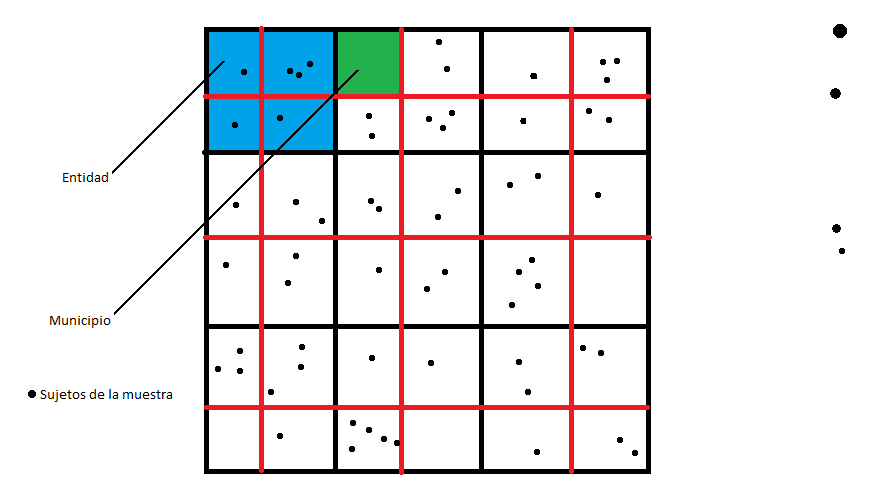

--- 
title: "Estimación en areas pequeñas"
author: "Alvaro Martínez Rodríguez"
date: "`r Sys.Date()`"
knit: "bookdown::render_book"
site: bookdown::bookdown_site
output:
 bookdown::bs4_book:
  theme:
    primary: "#3860b6"
    base_font: "Roboto"
  
documentclass: book
bibliography: [book.bib]
fontsize: 11pt
fontfamily: times
classoption: oneside
openright: yes
geometry: 
- tmargin=2.5cm
- bmargin=2.5cm
- lmargin=2.5cm
- rmargin=2.5cm
link-citations: yes
header-includes:
  - \usepackage[utf8]{inputenc} #para usar acentos
  - \usepackage[Glenn]{fncychap} #Formato de titulo de capitulo
  - \pagestyle{plain}
lang: es
---

# Introducción {-}

Las técnicas de estimación en áreas pequeñas (EAP) se diseñaron para resolver los problemas que genera la falta de información en la inferencia estadística clásica. De forma general, el método consiste en la utilización de censos o encuestas y de información auxiliar para "tomar prestada la fuerza", es decir, la riqueza de información de otras fuentes y así mejorar las estimaciones. El término "área pequeña" hace referencia a un área geográfica pequeña para la cual la muestra tomada de ella es insuficiente o no existe. Estas áreas suelen ser municipios, comarcas, alcaldías o sub-poblaciones.

Para explicar de mejor manera a qué se llama _área pequeña_ se ilustra el siguiente ejemplo:

Tenemos el siguiente cuadrado que representa un país 1.1 que esta subdividido en 9 entidades y se saca una muestra aleatoria representativa de cada entidad para observar el promedio del ingreso de cada sub-población. Con esto no tendríamos ningún problema para elaborar algún modelo de estimación del ingreso en el país (estimaciones directas); sin embargo, si quisiéramos trabajar con un nivel geográfico más pequeño, un municipio, por ejemplo, es probable que la muestra tomada de cada sub-población resulte insuficiente para realizar estimaciones puesto que habrá municipios de los que se tomó una mayor muestra o que ni siquiera estén representados. A estas se les conoce áreas pequeñas y se recurre a técnicas estadísticas especiales (estimaciones indirectas) para su estimación ya que resulta mucho más asequiblee que tomar una mayor muestra. **(Como se puede citar un video de youtube)**

```{r, echo=FALSE, fig.align='center',out.width='100%',fig.cap='Áreas pequeñas'} 

```

## Antecedentes {-}

Las EAP evolucionaron de métodos demográficos para la estimación de la población [@Gosh&Rao1994, p. 55-93] [@Mancho2002, p. 3]. Antes de los censos utilizaban registros administrativos poblacionales relativos a nacimientos, muertes, migración, etc. Si bien esta información no se obtenía con fines estadísticos, sí se puede extraer información útil para la inferencia estadística [@Erciulescu2018]. En [@Brackstone1987] se menciona que el uso de los registros administrativos para EAP data de siglo XI en Inglaterra, y el siglo XVII en Canadá. Existen registros que estos métodos empezaron a ser utilizados en Inglaterra, Estados Unidos y Canadá hacia finales del siglo XIX. [@Zhang2016] hicieron una revisión exhaustiva de EAP basados en registros.

En años posteriores y con el nacimiento de las encuestas de población, se desarrollaron métodos que combinan censos o encuestas con registros administrativos. [@Pursell1980] categorizaron esta clase de métodos bajo el nombre de _Técnicas Contables Sintomáticas (SAT en inglés)_. [@Gosh&Rao1994, p. 55-93] mencionan algunos de los métodos descritos en la literatura, estos son: las _Vital Rates method _ _(Bogue, 1950)_, método compuesto _(Bogue y Duncan, 1959)_, el Método del Componente del Censo II (CM-II) _(U.S. Bureau of the Census, 1966)_, el método de Registros Administrativos (AR) _(Starsinic, 1974)_, y el método de Unidad de Vivienda (HU) _(Smith y Lewis, 1980)_.

Actualmente las EAP han causado cada vez más interés en el sector público y privado debido a la alta demanda de obtener estimadores confiables para áreas pequeñas. Por ejemplo: "[...] se necesitan estadísticas de áreas pequeñas en la distribución de fondos gubernamentales y en la planificación regional y urbana. Además, [...] la formulación de políticas de muchas empresas e industrias depende de las condiciones socio económicas locales" [@Gosh&Rao1994, p. 56].

Como se mencionó anteriormente, la importancia estadística ha crecido en los últimos años por lo que también lo han hecho el número de investigaciones sobre el tema. El Instituto Nacional de Estadística (INE) de España,  utilizó estas técnicas para la Encuesta de Población Activa con información auxiliar de registros de población y laborales con el objetivo de estimar la población ocupada de las islas de Canarias [@Paños2000]. Se recurrió a estimadores sintéticos, a posteriori y compuestos, comparando su coeficiente de variación para determinar cuál es el menor sesgo. Se concluyó que las variables explicativas, así como la diferencia entre los vectores de efectivos observacionales que proporciona la EPA y la fuente estadística auxiliar serán determinantes de las varianzas estimadas del modelo.

[@Molina2010] realizaron un estudio para España en que se propone el uso de predicadores empíricos (EBP) obtenidos por simulaciones Monte Carlo para demostrar que las EBP de los indicadores de pobreza funcionan bien en términos de sesgo y MSE, en comparación con EAP desarrollados para la estimación de características lineales. También proponen un método de arranque paramétrico para la estimación de MSE y estudiar su sesgo a través de simulaciones. Sus resultados arrojaron que hay una reducción significativa en el coeficiente de variación de los mejores estimadores empíricos propuestos sobre los estimadores directos para prácticamente todos los dominios estudiados.

El [@Ministerio2017] realizó un documento en el que reporta sus hallazgos del uso de las EAP para la estimación de las tasas de pobreza en Chile a través la encuesta CASEN desde 2009 hasta 2017. En el documento se explica cómo se llevaron a cabo las estimaciones para cada año de la encuesta, así como sus actualizaciones metodológicas. Principalmente se utilizó el modelo de Fay-Harriot (1979) con variaciones a lo largo de los años.

Para el caso de México, el Instituto Nacional de Estadística y Geografía (INEGI) ha realizado varios trabajos de estimación en áreas pequeñas. En 2020, realizó un estudio sobre la _Prevalencia de Hipertensión y Obesidad, Diabetes para los Municipios de México 2018_. El objetivo de la institución fue de "estimar la proporción de la población de 20 años y más que padece enfermedades de Obesidad, para los municipios de México, mediante técnicas de Estimación para Áreas Pequeñas (EAP), a fin de ampliar la oferta de información derivada de la Encuesta Nacional de Salud y Nutrición (ENSANUT, 2018) y apoyar la toma de decisiones"[@INEGI2020EAP]. 

Por otra parte, [@Suárez2015] realizó un estudio sobre los ingresos por trabajo en la vivienda para todos los municipios y alcaldías de México. Hace comparación de los resultados de la estimación directa y los obtenidos por EAP. Utilizó los datos publicados por la ENIGH 2010 y CPV 2010. A través del modelo de Fay-Harriot (1979) comprueba la eficiencia de estas técnicas para estimaciones en pequeñas áreas que las encuestas no logran cubrir con suficientes datos.
 
El trabajo de [@Suárez2010] se combina la información de la ENIGH del año 2005 y el II Conteo de población y Vivienda levantado también en el año 2005 en particular del Estado de Sonora, mediante la aplicación y comparación de técnicas estadísticas que estiman y/o predicen el valor promedio del ingreso de los hogares en los 72 municipios del estado.